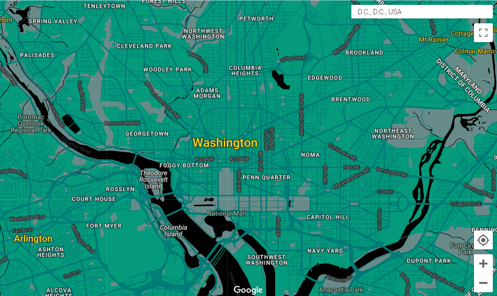

# Week 2 assignment - Build and deploy a custom Google Map for a non-profit organization

## Pallette 
| Feature type             | Element type          | Stylers                             |
| ------------------------ | --------------------- | ----------------------------------- |
| All                      | Geometry              | Color:  Teal (#049a7b)              |
| All                      | Labels / text fill    | Color: White (#ffffff)              |
| All                      | Labels / text outline | Color:  Dark Jungle Green (#212121) |
| Administrative           | Geometry              | Color: Boulder (#757575)            |
| Country                  | Labels / Text fill    | Color:  Candlelight (#fad60d)       |
| Locality                 | Labels / Text fill    | Color:  Candlelight (#fad60d)       |
| POI / Park               | Geometry              | Color: Blue Smoke (#688b89)         |
| POI / Park               | Labels / Text fill    | Color:  Green Spring Rain(#a3cfb2)  |
| POI / Park               | Labels / Text outline | Color:  Rangoon Green (#1b1b1b)     |
| Road                     | Geometry/ fill        | Color:  Pine Green (#007b76)        |
| Road                     | Labels / Text fill    | Color:  Oslo Grey (#8a8a8a)         |
| Road / Highway           | Geometry              | Color:  Pine Green (#007b76)        |
| Road / Controlled access | Geometry              | Color:  Pine Green (#007b76)        |
| Road / arterial          | Geometry              | Color:  Pine Green (#007b76)        |
| Road / local             | Labels / text fill    | Color:  Storm Dust (#616161)        |
| Transit                  | Labels / text fill    | Color: Boulder (#757575)            |
| Water                    | Geometry              | Color:  Black (#000000)             |
| Water                    | Labels/ text fill     | Color: Iridium  (#3d3d3d)           |

see the map on this [page](google_map_style_housingup.html)

## Design Choices
- I decided to make a map for a Affordable Housing/homeless support nonprofit called Housing Up, based in DC. I thought this would make a good example to work with as they have information on their website regarding the locations of their housing developments but no web map is present across the site. I have seen other housing organizations or providers typically have some sort of map that provides the locations of houses or projects (see [Action Housing](https://actionhousing.org/find-housing/general-properties-listings/) in Pittsburgh). I took a look as some of their webpages and mostly found different shades of green. I came across some of their shared annual reports and took inspiration for more colors (shades of teal, more greens, yellows, and grey).  
