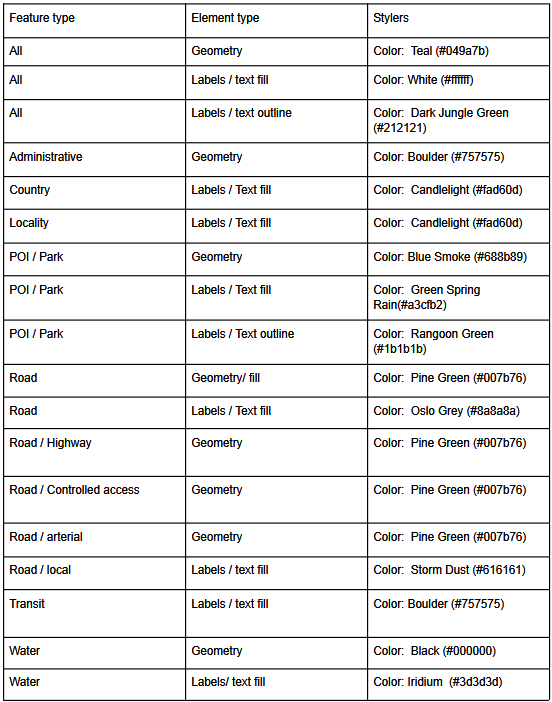

# Week 2 assignment - Build and deploy a custom Google Map for a non-profit organization

 
 
## Pallette 

# see the interactive version of the map on this [page](google_map_style_housingup.html)

## Design Choices
- I decided to make a map for a Affordable Housing/homeless support nonprofit called [Housing Up](https://housingup.org/), based in DC. I thought this would make a good example to work with as they have information on their website regarding the locations of their housing developments but no web map is present across the site. I have seen other housing organizations or providers typically have some sort of map that provides the locations of houses or projects (see [Action Housing](https://actionhousing.org/find-housing/general-properties-listings/) in Pittsburgh). I took a look as some of their webpages and mostly found different shades of green. I came across some of their shared annual reports and took inspiration for more colors (shades of teal, more greens, yellows, and grey).  
